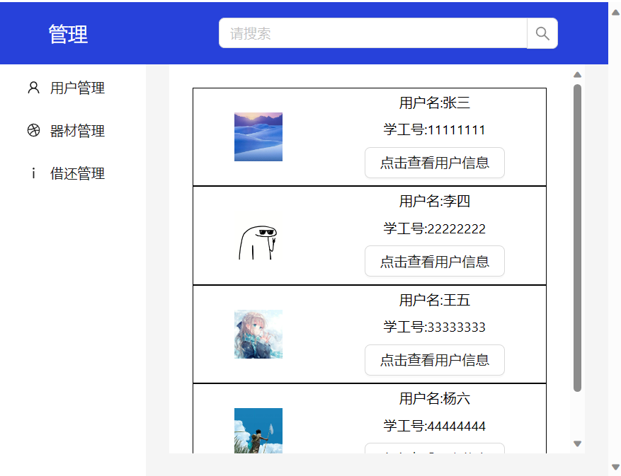
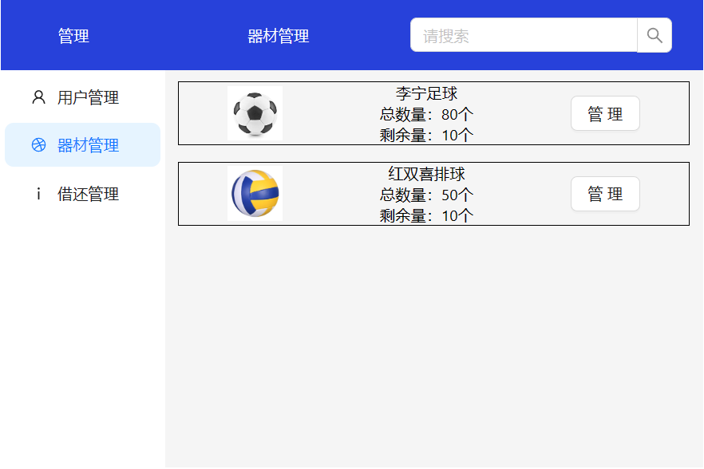
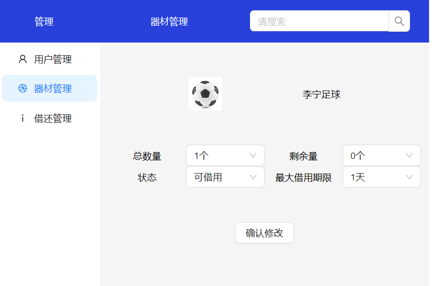
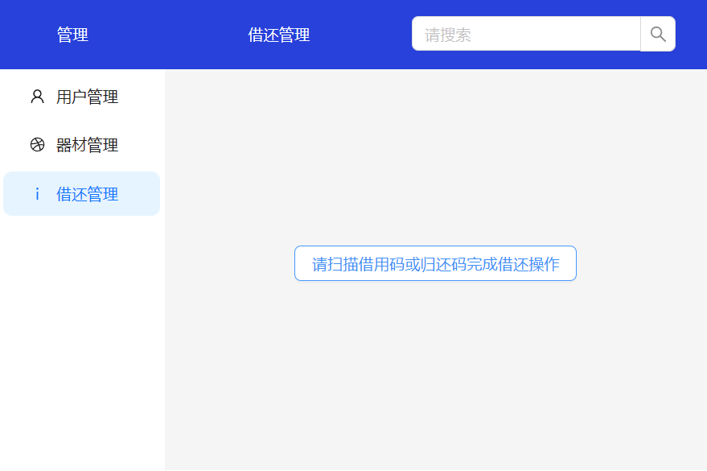

体育器材租借管理平台提供用户管理、器材管理和器材租借功能。项目分为前端模块和后端模块。
### 前端

前端使用React编写，分为用户管理、器材管理和器材租借功能。使用vite构建工具、react-router-dom路由库、antd组件库

#### 用户模块

用户模块提供查看和修改用户信息和器材借还信息

#### 器材模块

器材模块提供管理员管理器材借还限制的信息

#### 借还模块

借还模块用户扫码完成借还

#### 安装

环境 node（v16）

运行`npm run build`,nginx部署dist文件夹内容

### 后端

后端使用golang编写，使用gin和sqlx作为路由库和ORM库

#### 安装

环境 java（v17）maven（v3）

更改数据库连接url、用户名、密码信息，运行table.sql文件
运行jar包或运行`mvn install`
